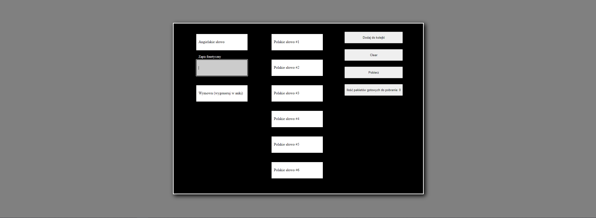
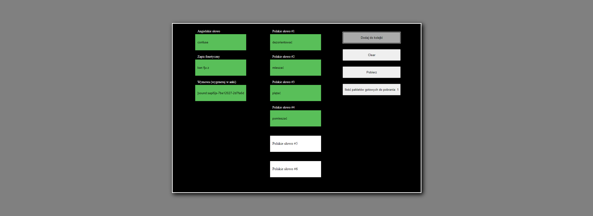

# Anki mixin
> A very simple website for personal home use to expedite adding new foreign language words to Anki [Anki](https://apps.ankiweb.net/).

## Table of contents
* [General info](#general-info)
* [Screenshots](#screenshots)
* [Technologies](#technologies)
* [Status](#status)
* [Contact](#contact)

## General info
We enter data for a given word, download a txt file containing the converted code, import it to the anki program into a specially configured card template for this code.

The application accelerated adding new words by at least 2x

The application has a lot of shortcomings and bugs, but this is an application only for me and I know exactly what to do and what not to do it flawlessly.

I am not correcting it because I have other projects that are more important to me. The assumption was to make a working, unreliable application, and it is. It works for me, and that's enough for me.

From time to time I change things that turn out to be wrong in practice when learning vocabulary

## Screenshots

***

## Technologies
* HTML - version 5
* CSS - version 3
* SCSS
* JavaScript

## Status
Project is: _in progress_

## Contact
Created by [@Grzegorz Stącel](mailto:stacelgrzegorz@gmail.com) - feel free to contact me!
